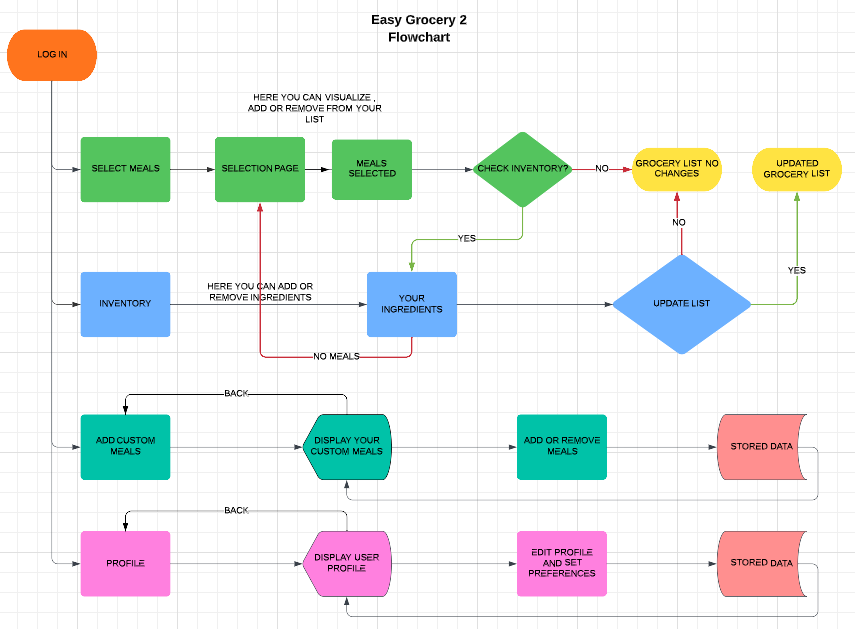

# Easy Grocery 2

Easy Grocery is a web application that allows users to create grocery lists from previously selected recipes. Users can log in, browse through a list of recipes, select recipes they want to cook, and generate a grocery list based on the ingredients required for the selected recipes. The application also allows users to customize their grocery list by indicating what ingredients they already have and removing unnecessary items. This makes grocery planning and shopping more efficient, helping users save time and reduce food waste.

## Table of Contents

- [UX (User Experience)](#ux-user-experience)
- [UI (User Interface)](#ui-user-interface)
- [Testing](#testing)

## UX (User Experience)

- [Overview](#ux-overview)
- [Usage Instructions](#ux-usage-instructions)
- [Configuration](#ux-configuration)
- [Navigation and Flow](#ux-navigation-and-flow)
- [Flowchart](#ux-flowchart)
- [Error Handling](#ux-error-handling)
- [Accessibility](#ux-accessibility)
- [Troubleshooting](#ux-troubleshooting)

### UX Overview

[Brief overview of the user experience]

### UX Usage Instructions

[Detailed usage instructions for users]

### UX Configuration

[Information on configuration for user experience]

### UX Navigation and Flow

[Information on how users navigate and interact with the software/project]

### UX Flowchart

  

### UX Error Handling

[Information on how errors or exceptions are handled from a user perspective]

### UX Accessibility

[Information on accessibility considerations and features]

### UX Troubleshooting

[Information on common issues and troubleshooting tips]

## UI (User Interface)

- [Visual Elements](#ui-visual-elements)
- [Layout](#ui-layout)
- [Design Principles](#ui-design-principles)
- [Interactions](#ui-interactions)
- [Visuals](#ui-visuals)
- [Responsive Design](#ui-responsive-design)
- [Theming or Customization](#ui-theming-or-customization)

### UI Visual Elements

[Description of visual elements in the user interface]

### UI Layout

[Description of the layout and organization of visual elements]

### UI Design Principles

[Description of design principles followed in the UI]

### UI Interactions

[Description of how users can interact with the UI]

### UI Visuals

[Screenshots or diagrams illustrating the UI]

### UI Responsive Design

[Information on how the UI is designed to be responsive or adaptable]

### UI Theming or Customization

[Information on options for theming or customizing the UI]

## Testing

[Information on testing procedures or guidelines]
